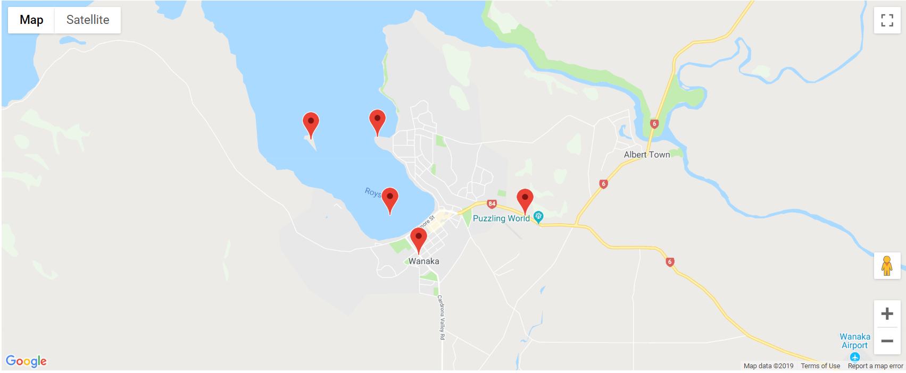

Keywords: javascript, react, hooks, fullstack, google-maps, backend, map, promise, async, reshuffle

This is a [Reshuffle](https://reshuffle.com/) template.

Map-markers is a template to demonstrate working with map data in Reshuffle.
It displays a map on the screen and attempts to set the map's center to the user's browser location.
It also lets the user click the map to add markers. These markers are persisted.

## Screenshots:

- A map displaying markers
  

